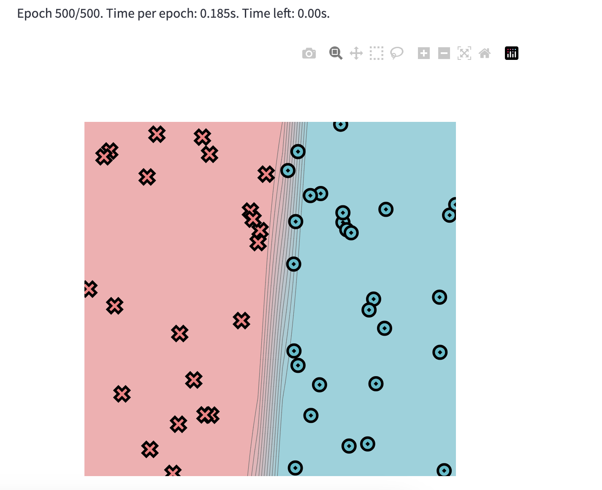
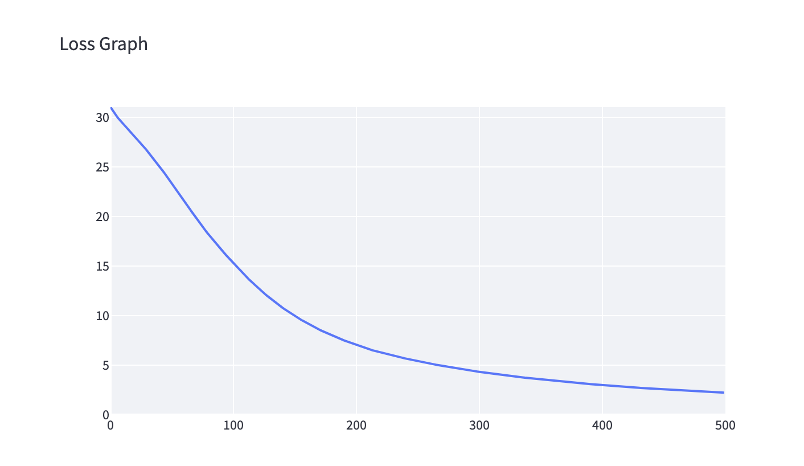

[](https://classroom.github.com/a/YFgwt0yY)
# MiniTorch Module 2


* Docs: https://minitorch.github.io/

* Overview: https://minitorch.github.io/module2/module2/

This assignment requires the following files from the previous assignments. You can get these by running

```bash
python sync_previous_module.py previous-module-dir current-module-dir
```

The files that will be synced are:

        minitorch/operators.py minitorch/module.py minitorch/autodiff.py minitorch/scalar.py minitorch/scalar_functions.py minitorch/module.py project/run_manual.py project/run_scalar.py project/datasets.py

Outputs:

<b>Simple</b>

Pts: 50

Size of Hidden Layer: 3

LR: .1




Epoch: 0/500, loss: 0, correct: 0
Epoch: 10/500, loss: 29.5287956677086, correct: 28
Epoch: 20/500, loss: 28.163316570062072, correct: 35
Epoch: 30/500, loss: 26.733295205750284, correct: 39
Epoch: 40/500, loss: 25.170693622320584, correct: 41
Epoch: 50/500, loss: 23.492382711625943, correct: 42
Epoch: 60/500, loss: 21.73176312934521, correct: 44
Epoch: 70/500, loss: 19.934593626412045, correct: 44
Epoch: 80/500, loss: 18.287909566687542, correct: 44
Epoch: 90/500, loss: 16.800055167151385, correct: 44
Epoch: 100/500, loss: 15.400231281238991, correct: 45
Epoch: 110/500, loss: 14.08843854490764, correct: 47
Epoch: 120/500, loss: 12.886324849500461, correct: 47
Epoch: 130/500, loss: 11.818310701776754, correct: 48
Epoch: 140/500, loss: 10.865695845013258, correct: 49
Epoch: 150/500, loss: 10.024737046073028, correct: 50
Epoch: 160/500, loss: 9.285575012928957, correct: 50
Epoch: 170/500, loss: 8.628218670592576, correct: 50
Epoch: 180/500, loss: 8.049422268386126, correct: 50
Epoch: 190/500, loss: 7.535427376612951, correct: 50
Epoch: 200/500, loss: 7.073860001713141, correct: 50
Epoch: 210/500, loss: 6.656237541169025, correct: 50
Epoch: 220/500, loss: 6.296170309584258, correct: 50
Epoch: 230/500, loss: 5.982230407463545, correct: 50
Epoch: 240/500, loss: 5.691631998678755, correct: 50
Epoch: 250/500, loss: 5.422031804019891, correct: 50
Epoch: 260/500, loss: 5.172911812494438, correct: 50
Epoch: 270/500, loss: 4.942001742177462, correct: 50
Epoch: 280/500, loss: 4.7273671566464195, correct: 50
Epoch: 290/500, loss: 4.527001166838712, correct: 50
Epoch: 300/500, loss: 4.339691967184676, correct: 50
Epoch: 310/500, loss: 4.164344033959287, correct: 50
Epoch: 320/500, loss: 3.9999666505012095, correct: 50
Epoch: 330/500, loss: 3.8456635184758996, correct: 50
Epoch: 340/500, loss: 3.7006233463613594, correct: 50
Epoch: 350/500, loss: 3.5648174478829757, correct: 50
Epoch: 360/500, loss: 3.4377262623211555, correct: 50
Epoch: 370/500, loss: 3.317651961617571, correct: 50
Epoch: 380/500, loss: 3.204065111746485, correct: 50
Epoch: 390/500, loss: 3.0964888978597016, correct: 50
Epoch: 400/500, loss: 2.994526400490386, correct: 50
Epoch: 410/500, loss: 2.898418327346782, correct: 50
Epoch: 420/500, loss: 2.807069888262304, correct: 50
Epoch: 430/500, loss: 2.7201534085086214, correct: 50
Epoch: 440/500, loss: 2.637959998933469, correct: 50
Epoch: 450/500, loss: 2.559957102049307, correct: 50
Epoch: 460/500, loss: 2.4854676786574452, correct: 50
Epoch: 470/500, loss: 2.4143248579168093, correct: 50
Epoch: 480/500, loss: 2.346470812369479, correct: 50
Epoch: 490/500, loss: 2.2815127488566174, correct: 50
Epoch: 500/500, loss: 2.2194558071393775, correct: 50


<b>Diag</b>

Pts: 50

Size of Hidden Layer: 3

LR: .5

Epoch: 0/500, loss: 0, correct: 0
Epoch: 10/500, loss: 12.522498537785745, correct: 46
Epoch: 20/500, loss: 11.99349641578316, correct: 46
Epoch: 30/500, loss: 11.374975446677333, correct: 46
Epoch: 40/500, loss: 10.62304920706582, correct: 46
Epoch: 50/500, loss: 9.69747625427245, correct: 46
Epoch: 60/500, loss: 8.585824689335093, correct: 46
Epoch: 70/500, loss: 7.361704436247507, correct: 46
Epoch: 80/500, loss: 6.208595935717168, correct: 47
Epoch: 90/500, loss: 5.4143220510200445, correct: 47
Epoch: 100/500, loss: 4.823572340691294, correct: 47
Epoch: 110/500, loss: 4.314071124622039, correct: 49
Epoch: 120/500, loss: 3.877583816576727, correct: 49
Epoch: 130/500, loss: 3.563736278764978, correct: 49
Epoch: 140/500, loss: 3.2811391355646524, correct: 49
Epoch: 150/500, loss: 3.0724560197708155, correct: 49
Epoch: 160/500, loss: 2.882261627864046, correct: 49
Epoch: 170/500, loss: 2.707379428507334, correct: 50
Epoch: 180/500, loss: 2.5459782101891797, correct: 50
Epoch: 190/500, loss: 2.396875555767799, correct: 50
Epoch: 200/500, loss: 2.2590944502877486, correct: 50
Epoch: 210/500, loss: 2.1317611470077473, correct: 50
Epoch: 220/500, loss: 2.0140588344173067, correct: 50
Epoch: 230/500, loss: 1.9052152401913531, correct: 50
Epoch: 240/500, loss: 1.8284300442304713, correct: 50
Epoch: 250/500, loss: 1.7371127428343356, correct: 50
Epoch: 260/500, loss: 1.6550712557210785, correct: 50
Epoch: 270/500, loss: 1.5799353522040689, correct: 50
Epoch: 280/500, loss: 1.5103385906598812, correct: 50
Epoch: 290/500, loss: 1.445430995417738, correct: 50
Epoch: 300/500, loss: 1.3846408450159176, correct: 50
Epoch: 310/500, loss: 1.3275535627240374, correct: 50
Epoch: 320/500, loss: 1.273847799041133, correct: 50
Epoch: 330/500, loss: 1.2232604297983332, correct: 50
Epoch: 340/500, loss: 1.1755666838945094, correct: 50
Epoch: 350/500, loss: 1.1305684648932866, correct: 50
Epoch: 360/500, loss: 1.088087271599633, correct: 50
Epoch: 370/500, loss: 1.0479597886478327, correct: 50
Epoch: 380/500, loss: 1.0100350742000648, correct: 50
Epoch: 390/500, loss: 0.9741727238241469, correct: 50
Epoch: 400/500, loss: 0.9402416384570297, correct: 50
Epoch: 410/500, loss: 0.9081191657511797, correct: 50
Epoch: 420/500, loss: 0.8776904714875565, correct: 50
Epoch: 430/500, loss: 0.8488480468792107, correct: 50
Epoch: 440/500, loss: 0.8214912957939037, correct: 50
Epoch: 450/500, loss: 0.7955261656025935, correct: 50
Epoch: 460/500, loss: 0.7708648012793544, correct: 50
Epoch: 470/500, loss: 0.7474252112498451, correct: 50
Epoch: 480/500, loss: 0.7067368337816254, correct: 50
Epoch: 490/500, loss: 0.7033673808605087, correct: 50
Epoch: 500/500, loss: 0.6825867014678196, correct: 50

<b>Split</b>

Pts: 50

Size of Hidden Layer: 7

LR: .5

Epoch: 0/500, loss: 0, correct: 0
Epoch: 10/500, loss: 32.16291944747219, correct: 36
Epoch: 20/500, loss: 31.474522780201998, correct: 36
Epoch: 30/500, loss: 30.710706707584595, correct: 36
Epoch: 40/500, loss: 29.797344713561586, correct: 36
Epoch: 50/500, loss: 28.73830753742565, correct: 37
Epoch: 60/500, loss: 27.39434221494575, correct: 37
Epoch: 70/500, loss: 25.844554580131373, correct: 37
Epoch: 80/500, loss: 24.376156357747693, correct: 36
Epoch: 90/500, loss: 21.49042750990958, correct: 40
Epoch: 100/500, loss: 17.24427298088472, correct: 44
Epoch: 110/500, loss: 13.735360810425584, correct: 47
Epoch: 120/500, loss: 9.73631244539388, correct: 48
Epoch: 130/500, loss: 17.965956350977955, correct: 42
Epoch: 140/500, loss: 10.772365632952708, correct: 44
Epoch: 150/500, loss: 11.149020713825058, correct: 44
Epoch: 160/500, loss: 10.504825195182491, correct: 44
Epoch: 170/500, loss: 8.501976042781124, correct: 44
Epoch: 180/500, loss: 7.865899278439654, correct: 44
Epoch: 190/500, loss: 7.65578119521059, correct: 44
Epoch: 200/500, loss: 6.983744848908205, correct: 46
Epoch: 210/500, loss: 6.485466645526653, correct: 46
Epoch: 220/500, loss: 6.375450520291418, correct: 46
Epoch: 230/500, loss: 6.012505811113891, correct: 46
Epoch: 240/500, loss: 5.51480911348875, correct: 46
Epoch: 250/500, loss: 5.2434591464446205, correct: 46
Epoch: 260/500, loss: 5.072564944006451, correct: 46
Epoch: 270/500, loss: 4.739475325448463, correct: 46
Epoch: 280/500, loss: 4.339127705102795, correct: 47
Epoch: 290/500, loss: 4.109491630713662, correct: 48
Epoch: 300/500, loss: 3.9951502198435223, correct: 48
Epoch: 310/500, loss: 3.993004910161917, correct: 48
Epoch: 320/500, loss: 3.6206597921573476, correct: 48
Epoch: 330/500, loss: 2.8979175010639673, correct: 49
Epoch: 340/500, loss: 2.4520327587036306, correct: 50
Epoch: 350/500, loss: 2.58219262139255, correct: 50
Epoch: 360/500, loss: 5.8033420923402455, correct: 46
Epoch: 370/500, loss: 5.802338422688543, correct: 46
Epoch: 380/500, loss: 1.5241563168737193, correct: 50
Epoch: 390/500, loss: 1.3712314164557948, correct: 50
Epoch: 400/500, loss: 1.2658169833945558, correct: 50
Epoch: 410/500, loss: 1.1772413287754224, correct: 50
Epoch: 420/500, loss: 1.0988218205846514, correct: 50
Epoch: 430/500, loss: 1.029305229468267, correct: 50
Epoch: 440/500, loss: 0.9672209903457699, correct: 50
Epoch: 450/500, loss: 0.9117822651576438, correct: 50
Epoch: 460/500, loss: 0.8617364874265099, correct: 50
Epoch: 470/500, loss: 0.816590807109326, correct: 50
Epoch: 480/500, loss: 0.7747721166501434, correct: 50
Epoch: 490/500, loss: 0.7369664986477671, correct: 50
Epoch: 500/500, loss: 0.701912687508114, correct: 50


<b>Xor</b>

Pts: 50

Size of Hidden Layer: 7

LR: .5

Epoch: 0/500, loss: 0, correct: 0
Epoch: 10/500, loss: 33.52154617824739, correct: 32
Epoch: 20/500, loss: 32.25688772467965, correct: 34
Epoch: 30/500, loss: 30.40392580135061, correct: 38
Epoch: 40/500, loss: 28.53164917036719, correct: 39
Epoch: 50/500, loss: 26.73360957561978, correct: 40
Epoch: 60/500, loss: 25.649465135627867, correct: 41
Epoch: 70/500, loss: 27.988719930648465, correct: 36
Epoch: 80/500, loss: 25.750874822045937, correct: 39
Epoch: 90/500, loss: 24.21060382853142, correct: 41
Epoch: 100/500, loss: 25.31202078162015, correct: 41
Epoch: 110/500, loss: 23.45274530797944, correct: 41
Epoch: 120/500, loss: 23.214095614134248, correct: 41
Epoch: 130/500, loss: 22.72440592405211, correct: 41
Epoch: 140/500, loss: 21.247831127224693, correct: 42
Epoch: 150/500, loss: 22.66834967563903, correct: 41
Epoch: 160/500, loss: 20.28568112384175, correct: 41
Epoch: 170/500, loss: 21.586560896452877, correct: 40
Epoch: 180/500, loss: 20.49614236657828, correct: 40
Epoch: 190/500, loss: 19.481273056490167, correct: 40
Epoch: 200/500, loss: 19.737848334192837, correct: 40
Epoch: 210/500, loss: 18.6191774470495, correct: 40
Epoch: 220/500, loss: 17.43271284295947, correct: 42
Epoch: 230/500, loss: 16.847657179437093, correct: 44
Epoch: 240/500, loss: 15.843017387948862, correct: 44
Epoch: 250/500, loss: 15.43535680765146, correct: 46
Epoch: 260/500, loss: 14.912769015747116, correct: 46
Epoch: 270/500, loss: 13.20426889018518, correct: 46
Epoch: 280/500, loss: 18.618746128364194, correct: 42
Epoch: 290/500, loss: 11.686412906604032, correct: 46
Epoch: 300/500, loss: 12.451945349497166, correct: 45
Epoch: 310/500, loss: 12.198176907041013, correct: 45
Epoch: 320/500, loss: 11.835540854030441, correct: 44
Epoch: 330/500, loss: 10.62160647090531, correct: 45
Epoch: 340/500, loss: 11.824954439286195, correct: 44
Epoch: 350/500, loss: 8.660531678520707, correct: 47
Epoch: 360/500, loss: 6.29371182204677, correct: 48
Epoch: 370/500, loss: 54.28418454361754, correct: 35
Epoch: 380/500, loss: 4.449682782891992, correct: 50
Epoch: 390/500, loss: 4.400393021894584, correct: 50
Epoch: 400/500, loss: 15.99466320098868, correct: 43
Epoch: 410/500, loss: 7.342891557153303, correct: 46
Epoch: 420/500, loss: 3.4407009365806203, correct: 50
Epoch: 430/500, loss: 4.011591116088752, correct: 49
Epoch: 440/500, loss: 15.017332756667559, correct: 45
Epoch: 450/500, loss: 3.325273026739252, correct: 50
Epoch: 460/500, loss: 3.126796448193825, correct: 50
Epoch: 470/500, loss: 4.718263441892214, correct: 48
Epoch: 480/500, loss: 14.384020651344652, correct: 45
Epoch: 490/500, loss: 3.327173605868187, correct: 49
Epoch: 500/500, loss: 2.6325001287933594, correct: 50
